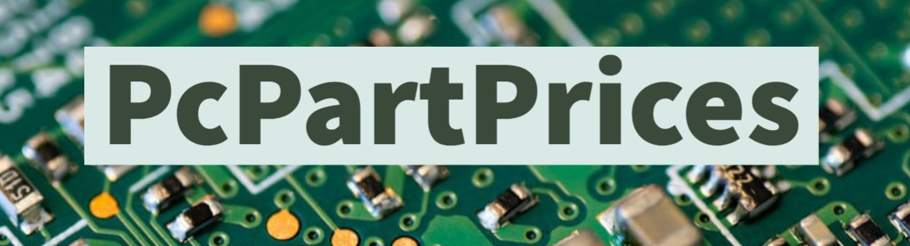
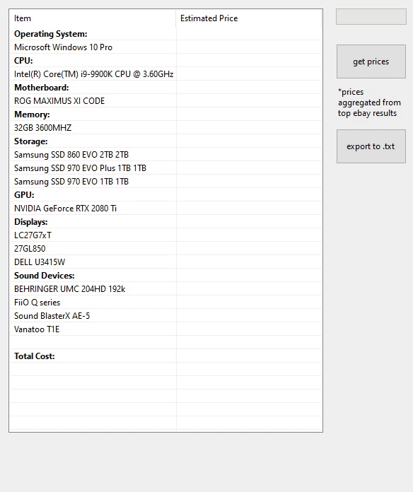
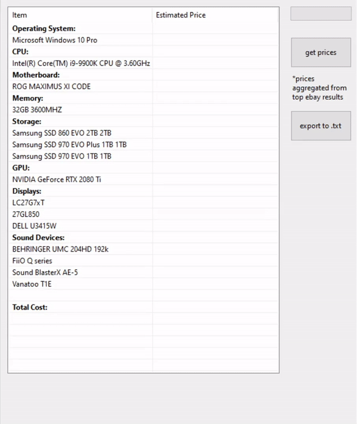

# 																

### The executable to easily list parts and estimate prices  🔥 🧻 📈

- I felt like creating something that included my passion for tech and hardware.

## Automated, Fast, Estimation

original program:

revised program with asynchronous requests:

- asynchronous version does the same thing but takes only around 15%as much time. that's about a 85% reduction in time when compared to the original (15~ seconds vs 2~ seconds). 
- with the fetched part names the application aggregates prices from one of the most popular marketplaces in the world!
- tested on windows 10

## Install

* Make sure you have [.NET Core Runtime](https://dotnet.microsoft.com/download/dotnet-core/current/runtime) installed! 32 or 64 bit whatever works with your Windows OS!
* Download [PcPartPrices.exe](https://github.com/nkinlui/pcpartprices/blob/master/PcPartPrices.exe) from the root folder and run it.
* That's it! Click "get prices" to fetch prices, and "export to .txt to" export comma separated results to a text file. The exported file named "PPP_results_MM-dd-yyyy" will be located in the same folder as the executable.

